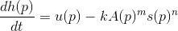
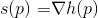

    <h1>Large Scale Terrain Generation from Tectonic Uplift andFluvial Erosion</h1>

Sumary and overview of [Large Scale Terrain Generation from Tectonic Uplift and Fluvial Erosion](https://hal.inria.fr/hal-01262376/document)

The complex landform features found in nature are mainly the result of the inter-action between the uplift factor and fluvial erosion, i.e., the action of water forming streams that carve the terrain while it grows.

## Uplife and Faults

Terrains result from the combined action of tec-tonic uplift of the Earth’s surface and erosion. Collisions between continental plates, as well as subduction of ocean plates under continental ones, cause the continental crust to shorten and thicken.
This results in the growth of mountains along the main boundariesbetween plates. Faults and folds appear in regions where the crustundergoes the highest stress

In geology, the term uplift is used to denote the local speed at which a mountain grows.

## Fluvial erosion

Is the erosion of the bedrock material and its trans-portation downhill by streams.

This can be moddeled by the stream power equation \[[WT99](#WT99)\]

The stream power equation states that the rate of change of sur-face topography _h(p)_ at a positionpis controlled by the balancebetween the surface uplift _u(p)_ and the fluvial erosion, which is afunction of the local slope _s(p)_ and the drainage area _A(p)_.

Thelocal slopes(p)is defined as the surface topographic gradient.

The constants _m_ and _n_ depend on rock strength, climate, and the topology of river networks.

As in most geomorphological studies, we use _n=1_ and _m=0.5_.

The drainage area _A(p)_ is the up-stream area draining through point _p_, assuming that water flows along the topo-graphic gradient.

The factor _k_ is an erosion constant thatdepends on many factors, such as lithology (the composition of thesoil/bedrock), vegetation, climate, and climate variability.

Note that, when applied at the right temporal and spatial scales (typically between 10^5 and 10^7 years and a few tens to hundreds of kilometers), the stream power equation does not only model erosion, but also captures the way a complex relief emerges from asupposedly flat part of the continental crust.

## Algorithm overview

The input to our algorithm is the uplift map _U_ defining the speed at which the terrain is elevated by tectonics.

"Our algorithm proceeds in two main steps: erosion simulation computed on planar graph _G_ embedding elevation and flow infor-mation, called thestream graph, and conversion of this graph in to an elevation model _M_ representing the terrain."

### Erosion simulation

Starting from the input domain _Ω_ where theuplift _U_ 6=0, we initialize the stream-graph _G_ as a random planargraph defined by triangulating uniformly distributed terrain samplepointspkin _Ω_. We set the initial elevation of the nodes hk of _G_ to zero. We then iterate the stream power equation until we get plausible elevation information (or water flow directions) associated to each node (or arc) of _G_. This is done by iterating the following steps until convergence.

1. A set of oriented stream trees _T_ covering the graph _G_ is exracted according to the current elevations _hk(t)_ of the nodes to model the direction of running water.

2. The set of stream trees _T_ is augmented by adding new arcs modeling water from lakes overflowing into streams, yielding a modified stream tree _~T_.

3. The drainage area _Ak(t)_ is computed for every node in the trees _~T_, and the local slope _sk(t)_ is evaluated from the current elevations _hk(t)_.

4. The stream power equation is solved to compute the new elevation values _hk(t+δt)_ from the uplift map _U_ and the new values of _Ak(t)_ and _sk(t)_.

This iterative process stops when a stabilization criterion is met.

### Conversion of the stream graph into a terrain model.

#### First

This can be used to visualize the simulation at interactive rates, uses a simple interpolation scheme to define _h_ from the elevation _shk_.

#### Second

The second method targets off-line high-quality rendering andgenerates a detailed terrain from the data embedded in the stream graph. This is achieved by combining procedural function-based primitives representing landform features as describedin \[[GGP∗15](#GGP15)\], which enables us to add visual details such as ridges,valleys, and river beds.

### Stream Generation

#### Stream Graph Initialisation

We use a coarse triangulation of the domainΩto initialize the(undirected) stream graph _G_.

Although our algorithm could also be applied to a regular grid, the randomized triangular graph generates more plausibleresults because the edges of the graph better represent possible directions for local streams.

In addition to its position _pk_, each graph node holds an initial height _hk=0_, an uplift value _uk=U(pk)_, and local values derived from the erosion parameters _k_,_m_ and _n_. Note that _hk_ is set constant for nodes lying on the border of the domain _Ω_. These nodes are tagged as external nodes and serve as river mouths,i.e., points atthe sea level, and are the outflows of _Ω_.

Finally, we compute a Voronoi tessellation of _Ω_ and assign an area value _ak_ to the nodes _Nk_, defined as the area of the Voronoi cell surrounding _Nk_.

#### Stream Tree Computation

Computing a set of (directed) stream trees that cover the graph and updating them at each iteration is the key for efficiently computing the drainage areas needed for solving in the stream power equation.

We define the set of directed stream trees _T_ as follows. For each node _Nk_, considering that water only flows from _Nk_ to its neighbor of the lowest elevation _Nl_, which we call the receiver of _Nk_,we connect _Nk_ to _Nl_ by an arc (a directed edge). 

This creates trees too the root nodes (i.e., lakes or outflows from the _Ω_).

By construction, the set _T_ covers _G_, in the sense that all the nodes of _G_ are included, although only a subset of the edges from _G_ is rrepresented by arcs in _T_.

Note on the first iteration all trees consist of just a root node.

#### Lake Overflow

## References

[GGP∗15] GÉNEVAUXJ.-D., GALINE., PEYTAVIEA., GUÉRINE.,BRIQUETC., GROSBELLETF., BENESB.: Terrain modelling from fea-ture primitives.Computer Graphics Forum 34, 6 (2015), 198–210.

[WT99] WHIPPLEK. X., TUCKERG. E.: Dynamics of the stream-power river incision model: Implications for height limits of moun-tain ranges, landscape response timescales, and research needs.Jour-nal of Geophysical Research: Solid Earth (1978–2012) 104, B8 (1999),17661–17674.
